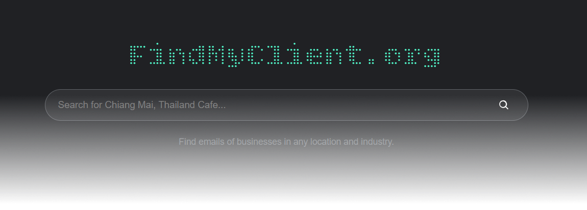
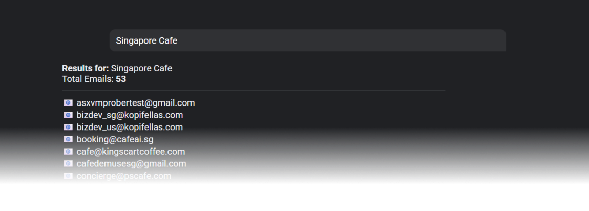

<div align="center">
    <p>
        
    </p>
    <a href="https://www.python.org/" target="_blank"></a>
    <a href="#"></a>
    <a href="#"></a>
    <a href="#"></a>
</div>
<div align="center">

### 🏷️ Topics
`lead-generation` · `email-scraper` · `web-scraping` · `google-places-api` · `gemini-ai` · `python` · `flask` · `business-intelligence` · `cold-outreach` · `data-extraction`
</div>
<p align="center">
  <b>AI-powered lead generation tool that scrapes real-time business websites to extract public contact emails using Google Places + Gemini AI.</b>
</p>

<br>


## 🌐 What is FindMyClient.org?

📖 For full documentation powered by <a href="https://deepwiki.com/Rottie420/findmyclient" target="_blank">DeepWiki</a><br><br>
**Most tools are expensive and rely on outdated databases.**

This tool:

- 🛜 Uses live website data
- 🔍 Finds fresher emails
- 📌 Works for any location
- ⚡Stays lightweight and fast

<br>

**FindMyClient.org** is a free and open-source tool for discovering public business contact information.
Built for developers, founders, and small teams who want a simple way to find business emails without expensive subscriptions or locked databases.

Search any industry and location to discover and It pulls live data from business websites, so results stay fresh and relevant.

<div align="center">
    <p>
        
    </p>
</div>
<br>


## ✨ Features

- 🔍 Find businesses using location + keyword  
- 📧 Extract publicly listed emails  
- 📄 Detect contact/about pages 
- ⚡ Fast and lightweight backend 

<br>


## 💼 Use Cases

### Lead Generation
Find local business contacts for outreach campaigns.

**Examples:**
- 🍵 Chiang Mai, Thailand Cafe  
- 📢 Marketing agencies in Dubai  
- 🍔 Restaurants in London  


<br>


## ⚙️ Getting Started
### 1. Clone the repository

```bash
git clone https://github.com/Rottie420/findmyclient.git
cd findmyclient
```

<br>

### 2. Create virtual environment

```bash
python -m venv venv
venv\Scripts\activate
```

<br>

### 3. Install dependencies

```bash
pip install -r requirements.txt
```

<br>

### 4. Create a .env file

```bash
APP_SECRET_KEY=your_secret_key
PLACES_API_KEY=your_google_places_api_key
GEMINI_API_KEY=your_gemini_api_key
GEMINI_MODEL_NAME=gemini-model-name
```

<br>

### 4. Run the app

```bash
python -m app.py
http://localhost:5000
```

<br>

> [!IMPORTANT]
> **FindMyClient.org** extracts publicly available contact information from business websites.
> Users are responsible for complying with the local laws and outreach regulations.
